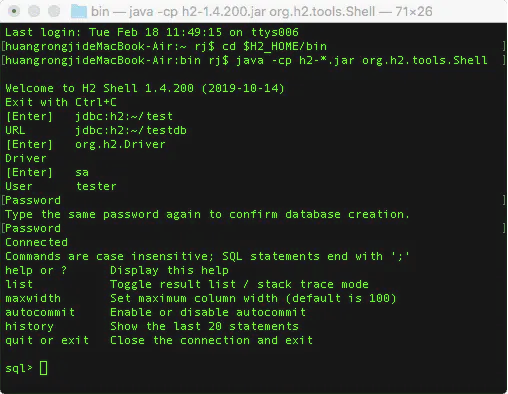
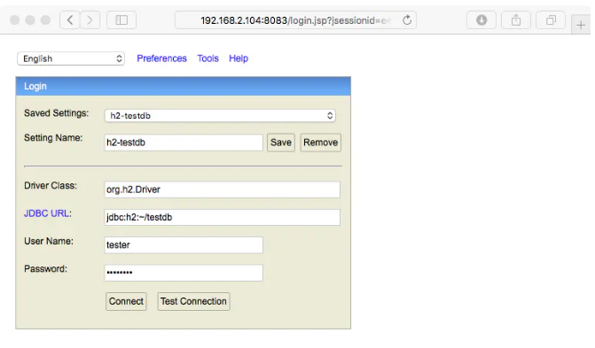
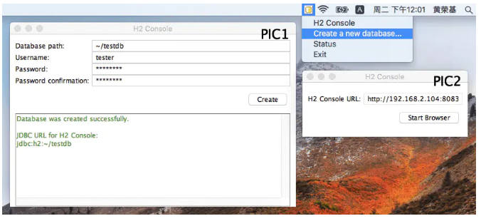

#### H2 嵌入式数据库安装和使用

H2 是一种嵌入式数据库，可以非常方便的做一些个人项目，也可以很方便的安装和使用。  

1. 下载  
    H2 的官方地址是：https://h2database.com，在 Download 部分选择 Windows Installer 下载 .exe 文件，然后双击安装。

2. 安装  
    双击 .exe 文件后一步步按照提示安装h2 数据库，选择自己想要安装的地址，安装成功后将得到 h2 目录，目录结构如下：  
    H2/  
    |--bin/  
    |  |--h2-1.4.200.jar  
    |  |--h2.bat  
    |  |--h2.sh  
    |  |--h2w.bat  
    |--docs/  
    |--service/  
    |--src/  
    |--build.bat  
    |--build.sh  

3. 创建数据库  
    在安装的 H2 数据库文件夹下，打开 gitbash 终端输入:
    > java -cp h2-*.jar org.h2.tools.Shell

    按照指引一步步创建本地数据库，如下图所示：  
    
    
    上述命令执行完毕后，将在用户目录下生成名称为 testdb.mv.db 的数据库文件。数据库名称为 testdb、连接账号
    为 tester、连接密码为 password，这些参数都可以按需指定，指定的账号 tester 将自动视为数据库 testdb 的管理员账号。

    如果不想将数据库创建在用户目录下，可以使用 jdbc:h2:[file:][< path >]<databaseName> 格式指定数据库保存
    的路径。如果要直接在内存中创建数据库，则使用 jdbc:h2:mem:< databaseName > 格式。
    更多支持的连接 URL 格式可查阅官方文档《Database URL Overview》。
    
    上述是显式预先创建数据库的方式，如果客户端使用带 embedded URL 的格式连接 H2 数据库，而该数据库还没有
    创建，默认情况下 H2 会自动创建这个数据库（远程连接情况下则默认报错），而创建这个数据库的用户就自动成为
    该数据库的管理员，详见官方文档《Connecting to an Embedded (Local) Database》的说明。
    如果要禁止默认创建不存在的数据的这种行为（Here），可以在 URL 后添加 ;IFEXISTS=TRUE 即可，如 
    jdbc:h2:/data/sample;IFEXISTS=TRUE。
    
    指定连接账号密码的 URL 格式为：'jdbc:h2:<url>[;USER=< username >][ ;PASSWORD=< value > ]'，如 
    > jdbc:h2:file:~/sample;USER=sa;PASSWORD=123
    
    Java 代码连接 H2 数据库的例子：
    ```text
    import java.sql.*;
    public class Test {
      public static void main(String[] a) throws Exception {
        Connection conn = DriverManager.getConnection("jdbc:h2:~/test", "sa", "");
        // add application code here
        conn.close();
      }
    }
   ```

4. 可选配置  
    在用户目录下新建 .h2.server.properties，支持如下属性配置：
    
    - webAllowOthers: 是否允许远程连接，默认 false。
    - webPort: h2 端口，默认为 8082。
    - webSSL: 是否启用 SSL 加密连接，默认 false。
    - webAdminPassword: 超级管理员密码。
    > 如果没有手动配置此文件，以 web-server 方式首次启动 H2 后，点击打开的浏览器页面的 Save 按钮后就会自动创建一个。
    
    .h2.server.properties 文件范例：
    ```text
        #H2 Server Properties
        webAllowOthers=true
        webPort=8083
        webSSL=false
        
        # Tue Feb 18 14:28:25 CST 2020
        0=Generic JNDI Data Source|javax.naming.InitialContext|java\:comp/env/jdbc/Test|sa
        1=Generic Teradata|com.teradata.jdbc.TeraDriver|jdbc\:teradata\://whomooz/|
        2=Generic Snowflake|com.snowflake.client.jdbc.SnowflakeDriver|jdbc\:snowflake\://accountName.snowflakec3=Generic Redshift|com.amazon.redshift.jdbc42.Driver|jdbc\:redshift\://endpoint\:5439/database|
        4=Generic Impala|org.cloudera.impala.jdbc41.Driver|jdbc\:impala\://clustername\:21050/default|
        5=Generic Hive 2|org.apache.hive.jdbc.HiveDriver|jdbc\:hive2\://clustername\:10000/default|
        6=Generic Hive|org.apache.hadoop.hive.jdbc.HiveDriver|jdbc\:hive\://clustername\:10000/default|
        7=Generic Azure SQL|com.microsoft.sqlserver.jdbc.SQLServerDriver|jdbc\:sqlserver\://name.database.windows.net\:1433|
        8=Generic Firebird Server|org.firebirdsql.jdbc.FBDriver|jdbc\:firebirdsql\:localhost\:c\:/temp/firebird/test|sysdba
        9=Generic SQLite|org.sqlite.JDBC|jdbc\:sqlite\:test|sa
        10=Generic DB2|com.ibm.db2.jcc.DB2Driver|jdbc\:db2\://localhost/test|
        11=Generic Oracle|oracle.jdbc.driver.OracleDriver|jdbc\:oracle\:thin\:@localhost\:1521\:XE|sa
        12=Generic MS SQL Server 2000|com.microsoft.jdbc.sqlserver.SQLServerDriver|jdbc\:microsoft\:sqlserver\://localhost\:1433;DatabaseName\=sqlexpress|sa
        13=Generic MS SQL Server 2005|com.microsoft.sqlserver.jdbc.SQLServerDriver|jdbc\:sqlserver\://localhost;DatabaseName\=test|sa
        14=Generic PostgreSQL|org.postgresql.Driver|jdbc\:postgresql\:test|
        15=Generic MySQL|com.mysql.jdbc.Driver|jdbc\:mysql\://localhost\:3306/test|
        16=Generic HSQLDB|org.hsqldb.jdbcDriver|jdbc\:hsqldb\:test;hsqldb.default_table_type\=cached|sa
        17=Generic Derby (Server)|org.apache.derby.jdbc.ClientDriver|jdbc\:derby\://localhost\:1527/test;create\=true|sa
        18=Generic Derby (Embedded)|org.apache.derby.jdbc.EmbeddedDriver|jdbc\:derby\:test;create\=true|sa
        19=Generic H2 (Server)|org.h2.Driver|jdbc\:h2\:tcp\://localhost/~/test|sa
        20=Generic H2 (Embedded)|org.h2.Driver|jdbc\:h2\:~/test|sa
        21=h2-testdb|org.h2.Driver|jdbc\:h2\:~/testdb|tester
    ```
    注：在 H2 Control 每次构建的数据库连接保存后都会作为历史配置项自动保存到 .h2.server.properties 文件内，一行一个链接配置，格式为 <number>=<name>|<driver>|<url>|<user>。
    上述编号 0～20 的连接配置是 H2 默认提供的，编号 21 是我自行创建保存的，连接的密码因安全性不会保存下来。

5. 启动数据库  
    5.1. 以 web-server 方式启动 (For H2 Console，将下面的 h2-1.4.200.jar 换成自己的版本)  
    > java -jar h2-1.4.200.jar
    
    启动后会自动用默认浏览器打开 http://localhost:8082。默认浏览器也可通过系统环境变量 BROWSER 或者 
    java 属性 h2.browser 来配置。界面截图如下：
    
    
    此方式启动成功后，系统托盘也会出现一个 h2 的小图标，点击可以看到如下功能菜单：  
    - H2 Console < 点击打开浏览器 Console
    - Create a new Database... < 点击弹出窗口来创建数据库
    - Status < 弹出窗口告诉你浏览器的链接
    - Exit  
    如下图所示：  
    
    点击 'Create a new Database...' 对应图中的 PIC1、点击 'Status' 对应图中的 PIC2
    
    > 只有通过这种方式启动的 H2，才允许通过浏览器访问数据库及有系统托盘图标。

    5.2. 以 tcp-server 方式启动  
    > java -cp h2-1.4.200.jar org.h2.tools.Server  
    TCP server running at tcp://192.168.2.104:9092 (only local connections)  
    PG server running at pg://192.168.2.104:5435 (only local connections)  
    Web Console server running at http://192.168.2.104:8083 (others can connect)  

    使用 java -cp h2*.jar org.h2.tools.Server -? 可以输出支持的参数。要启用远程连接则需要添加参数 --tcpAllowOthers。
    
    以此方式启动的 H2 并不会打开数据库，直到有客户端连接的时候数据库才会自动打开。
    
    客户端使用 'jdbc:h2:tcp://< server >[:< port>]/[< path>]<databaseName>' 的 URL 格式连接数据库，如：  
    - jdbc:h2:tcp://localhost:8082/~/test
    - jdbc:h2:tcp://dbserv:8084/~/sample
    - jdbc:h2:tcp://localhost/mem:test  
    对应的关闭数据库的终端命令为：
    > $ java -cp h2*.jar org.h2.tools.Server -tcpShutdown tcp://192.168.2.104:9092 -tcpPassword password  
    Shutting down TCP Server at tcp://192.168.2.104:9092  

    能使用这个命令关闭 tcp-server 的前提是，在启动命令中也必须添加 -tcpPassword password，两者的密码要互相对应才行。

6. 关闭数据库  
    默认情况下当最后一个连接关闭后，数据库会自动关闭。为了提高应用的连接性能，可以控制 DB_CLOSE_DELAY 的值来延迟一定秒数后再关闭，方法有两种：

    方法一：执行 SQL statment 'SET DB_CLOSE_DELAY <seconds>‘

    方法二：在连接的 URL 中设置，如 'jdbc:h2:~/test;DB_CLOSE_DELAY=10'

    值设置为 -1 代表禁用自动关闭功能。如果设置为 -1，虽然连接关闭后数据保持打开状态，但如果 JAVA 的 VM 
    正常退出的话，这种情况下 H2 会使用 vm 的 shutdown hook 自动关闭数据库。如果要禁用这种行为，
    需要在首个连接数据库的 URL 中指定 ;DB_CLOSE_ON_EXIT=FALSE，如 
    'jdbc:h2:~/test;DB_CLOSE_ON_EXIT=FALSE'。
    官方文档相关说明可参阅《Closing a Database》。