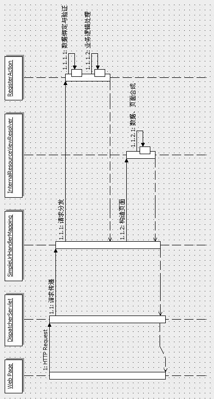

## 基础知识介绍： 

#### **1. IOC和DI**  

**IOC(Inversion Of Control): 控制反转**  
>即控制权的转移，将我们创建对象额方式反转了，以前对象的创建是由我们开发人员自己维护的，包括依赖关系也是自己注入。
使用了Spring之后，对象的创建和依赖关系的注入可以由Spring完成。控制反转也就是说从我们自己创建反转为由程序创建（Spring）。

**DI(Dependency Injection): 依赖注入**  
>Spring这个容器中，替你管理着一系列的类，前提是你需要将这些类交给Spring容器进行管理，然后在你需要的时候，不是自己去定义
而是直接向Spring容器索取，当Spring容器知道你的需求之后，就会去它管理的组件中进行查找，然后直接给你所需要的组件。这
也就是说组件之间的依赖关系由容器在`运行期`决定。

**实现IOC思想需要DI做支持：**  
注入方式： 1.set方式注入；2.构造方法注入；3.基于注解注入  
注入类型： 1.值类型注入；2.引用类型注入  

#### **2. Spring Bean 封装机制：**  
Spring从核心而言，是一个DI容器，它的设计意义是提供一种无侵入式的高扩展性框架。即无需代码中涉及Spring专有类，就能将
其纳入Spring容器进行管理。  
为了实现这一点，Spring 大量引入了 Java 的 Reflection 机制，通过动态调用的方式避免硬编码，并在此基础上建立了它的核心组件
BeanFactory，以此作为依赖注入机制实现的基础。org.springframework.beans 包中包括了这些核心组件的的实现类，
核心中的核心为 `BeanWrapper 和 BeanFactory 类`。  

**Bean Wrapper：**  
所谓依赖注入，就是在运行时期，由容器将依赖关系注入到组件之中。用 Spring 配置文件，将其他对象的引用通过组件提供的
Setter 方法进行设定。我们知道，如果动态的设置一个对象的属性，可以借助 Java 的 Reflection 机制实现：
```
Class cls = Class.forName("cn.yang.example.beans.User");
Method mtd = cls.getMethod("setName", new Class[]{String.class});
Object obj = (Object)cls.newInstance();
mtd.invoke(obj, new Object[]{"Erica"});
return obj;
```
上面我们通过动态加载 User 类，并通过 Reflection 调用 User.setName() 方法设置其属性，这里为了方便，我们将
类名和方法名都使用字符串硬编码，假设这些常量都是通过`配置文件`读入，那我们就实现了一个最简单的 BeanWrapper。
它的功能很简单，提供一个设置 JavaBean 属性的通用方法。Spring BeanWrapper 基于同样的原理，提供了一个更加完善的实现。
看看如何通过Spring BeanWrapper操作一个JavaBean：  
```
Object obj = Class.forName("cn.yang.example.beans.User").newInstance();
BeanWrapper bw = new BeanWrapperImpl(obj);
bw.setPropertyName("name", "Erica");
System.out.println("User name => " + bw.getPropertyValue("name"));
```
通过这样的方式设定 JavaBean 的属性确实是有点繁琐，但是它确实提供了一个通用的属性设定机制，而这样的机制正是 Spring 
依赖注入机制的基础。  

**Bean Factory:**  
Bean Factory 负责根据配置文件创建 Bean 实例，可以配置的项目有：  
（1）. Bean 属性值及依赖关系（对其他 Bean 的引用）。  
（2）. Bean 创建模式（是否 Singleton 模式，即是否维持全局唯一的实例）。  
（3）. Bean 初始化和销毁方法。  

下面列举了一个比较完整的 Bean 配置实例：  
```xml
<beans>
    <description>Spring Bean Configuration Sample</description>
    <!--id: Java Bean 在 Bean Factory 中的唯一标识，代码中通过这个标识获取 Java Bean 实例-->
    <!--class: Java Bean 类路径-->
    <!--singleton: 是否只维护一个实例-->
    <!--init-method: 初始化方法，此方法将在BeanFactory创建JavaBean实例之后，在向应用层返回引用之前执行。
            一般用于一些资源的初始化工作。-->
    <!--destroy-method: 销毁方法。此方法将在BeanFactory销毁的时候执行，一般用于资源释放。-->
    <!--depends-on: Bean依赖关系。一般情况下无需设定。Spring会根据情况组织各个依赖关系的构建工作
            只有某些特殊情况下，如JavaBean中的某些静态变量需要进行初始化（这是一种Bad Smell，应该在设计上应该避免）。
            通过depends-on指定其依赖关系可保证在此Bean加载之前，首先对depends-on所指定的资源进行加载。-->
    <bean id="TheAction" class="cn.yang.beans.UpperAction" singleton="true" init-method="init" 
    destroy-method="cleanup" depends-on="ActionManager">
        <property name="message">
            <value>HELLO</value>
        </property>
        <property name="desc">
            <null/>
        </property>
        <property>
            <!--ref: 指定属性对其他Bean的引用。Bean Factory 将在运行期创建dataSource bean实例，并将其引用传入TheAction Bean的dataSource属性-->
            <ref local="dataSource"/>
        </property>
    </bean>
    
    <bean id="dataSource" class="org.springframework.jndi.JndiObjectFactoryBean">
        <property name="jndiName"> <value>java:comp/env/jdbc/sample</value> </property>
    </bean>
</beans>
``` 

**比较BeanWrapper 和 BeanFactory:**  
BeanWrapper 实现了对单个Bean 的属性设定操作。而BeanFactory 则是针对多个Bean 的管理容器，根据给定的配置文件，
BeanFactory 从中读取类名、属性名/值，然后通过reflection 机制进行Bean 加载和属性设定。

#### **3. ApplicationContext**  
BeanFactory 提供了针对Java Bean 的管理功能，而 ApplicationContext 提供了一个更加框架化的实现。ApplicationContext
覆盖了 BeanFactory 的所有功能，并提供了更多的特性，此外，ApplicationContext 为与现有应用框架相整合，提供了更为开放式
的实现（如对于 WEB 应用，我们可以在 web.xml 中对 ApplicationContext 进行配置）。  
相对BeanFactory而言，ApplicationContext提供了以下扩展功能：  
**（1）国际化支持**  
国际化支持在实际开发中可以说是最常用的特性。对于一个需要支持不同语言环境的应用而言，通常的策略是通过一个独立的资源文件，
（如一个properties文件）完成所有语言信息（如界面上的提示信息）的配置。Spring 对这种传统的方式进行了封装，并提供了更加
强大的功能，如信息的自动化配置以及热部署功能（配置文件被修改后自动读取，而无需重新启动应用程序），下面是一个典型示例：  
```xml
<beans>
    <description>Spring Quick Start</description>
    <bean id="messageSource" class="org.springframework.context.support.ResourceBundleMessageSource">
        <property name="basenames">
            <list><value>messages</value></list>
        </property>
    </bean>
</beans>
```
这里声明了一个名为 messageSource 的 Bean（注意对于 Message 定义，Bean ID 必须为 messageSource，这是目前Spring 的编码规约）。
目前 Spring 中提供了两个 MessageSource 接口的实现，即 `ResourceBundleMessageSource` 和 `ReloadableResourceBundleMessageSource`.
后者提供了无需重启即可重新加载配置信息的特性。  
在配置节点中，我们指定了一个配置名“messages”，Spring 会自动在 CLASSPATH 根路径中按照如下顺序搜寻配置文件并进行加载（
以 Locale 为 zh_CN为例）:  
messages_zh_CN.properties  
messages_zh.properties  
messages.properties  
messages_zh_CN.class  
messages_zh.class  
messages.class  
（Spring 实际上调用了 JDK 的 ResourceBundle 读取配置文件，详情请参考 JDK 文档）  
    
**（2）资源访问**  
ApplicationContext.getResource 方法提供了对资源文件访问支持，如：  
```
Resource rs = ctx.getResource("classpath:config.properties");
File file = rs.getFile();
```
上例从 CLASSPATH 根路径中查找 config.properties 文件并获取其文件句柄，getResource 方法的参数为一个资源访问地址，如：  
file:C:/config.properties  
/config.properties  
classpath:config.properties  
注意 getResource 返回的 Resource 并不一定真实存在，可以通过 Resource.exists() 方法对其进行判断。  
    
**（3）事件传播**  
ApplicationContext 基于 Observer 模式，提供了针对 Bean 的事件传播功能。通过 Application.publishEvent 方法，
我们可以将事件通知系统内所有的 ApplicationListener。  
事件传播的一个典型是，当 Bean 中的操作发生异常（如连接数据路失败），则通过事件传播机制通知异常监听器进行处理。  
**Web Context**  
ApplicationContext ctx=new FileSystemXmlApplicationContext("bean.xml"); 这里是使用编码加载 ApplicationContext。
对于 Web 应用，Spring 提供了可配置的 ApplicationContext 加载机制。加载器目前有两种选择：ContextLoaderListener 和
ContextLoaderServlet。这两者在功能上完全相同，只是一个基于 Servlet2.3 版本中新引入的 Listener 接口实现，而另一个基于
Servlet 接口实现。开发中可根据目标 Web 容器的实际情况进行选择。配置很简单，在 web.xml 中增加：  
```xml
<listener>
    <listener-class>
        org.springframework.web.context.ContextLoaderListener
    </listener-class>
</listener>
``` 
或者是：  
```xml
<servlet>
    <servlet-name>context</servlet-name>
    <servlet-class>
        org.springframework.web.context.ContextLoaderServlet
    </servlet-class>
    <load-on-startup>1</load-on-startup>
</servlet>
```
通过以上配置，Web 容器会自动加载 /WEB-INF/applicationContext.xml 初始化。以下是 ApplicationContext 实例，如果需要指定
配置文件的位置，可通过 context-param 加以指定：  
```xml
<context-param>
    <param-name>contextConfigLocation</param-name>
    <param-value>/WEB-INF/myApplicationContext.xml</param-value>
</context-param>
```
配置完成后，即可通过 WebApplicationContextUtils.getWebApplicationContext 方法在 Web 应用中获取 ApplicationContext 引用。

#### **4. Spring 高级特性**  
Web 应用与MVC：  
目前比较好的 MVC，老牌的有 Struts/webwork. 新兴的 MVC 框架有 Spring MVC、Tapestry、JSF等。这些大多是著名团队
的作品，另外还有一些边缘团队的作品，也相当出色，如 Dinamica、VRaptor。  

**（1）Spring MVC**  
对于现在比较成熟的 Model-View-Control 框架而言，其解决的问题不外乎下面几部分：  
将 Web 页面中的输入元素封装为一个（请求）数据对象。  
根据请求的不同，调度相应的逻辑处理单元，并将（请求）数据对象作为参数传入。  
逻辑处理单元完成运算后，返回一个结果数据对象。  
将结果数据对象的数据与预先设计的表现层相融合并展现给客户。  

各个 MVC 实现虽然存在差异，但其中的关键流程大致如上描述。结合一个实例，来看几个关键流程在 Spring MVC 框架中的处理方法：  
下面的实例，实现了一个常见的用户登录逻辑，即用户通过用户名和密码登录，系统对用户名和密码进行检测，如果正确，则在
页面上显示几条登录信息，如果登录失败，则返回失败界面。（实例中，以 JSP2.0 实现）  
对应的 index.html：  
```html
<html>
    <body>
        <form method="POST" action="/login.do">
            <p align="center">登录</p>
            <br>
                用户名:
                <input type="text" name="username" >
            <br>
                密 码 :
                <input type="password" name="password" >
            <br>
            <p>
                <input type="submit" value="提交" name="B1">
                <input type="reset" value="重置" name="B2">
            </p>
        </form>
    </body>
</html>
```
很简单的一个登录界面，其中包含了一个用以输入用户名和密码的 form ，针对此 form 的提交将会被发送到 "/login.do"。  
MVC 关键流程的第一步，即收集页面输入参数，并转换为请求数据对象。这个静态页面提供了一个基本的输入界面，这些输入数据将会
被提交到何处，将如何被转换为请求数据对象？  
    
现在来看接下来发生的事情：
当用户输入用户名和密码并提交之后，此请求将会被`递交给 Web 服务器处理`，上面我们设定 form 提交目标为 "/login.do"，
那么 Web 服务器将如何处理这个请求？  
显然，标准 http 协议中，并没有以 .do 为后缀的服务资源，这是我们自己定义的一种服务请求模式，此模式在 web.xml 中定义：
```xml
<?xml version="1.0"  encoding="UTF-8"?>
<web-app xmlns="http://java.sun.com/xml/ns/j2ee" 
        xmlns:xsi="http://www.w3.org/2001/XMLSchema-instance"
        xsi:schemaLocation="http://java.sun.com/xml/ns/j2ee
        http://java.sun.com/xml/ns/j2ee/web-app_2_4.xsd"
        version="2.4">
    <servlet>
        <servlet-name>Dispatcher</servlet-name>
        <servlet-class>
            org.springframework.web.servlet.DispatcherServlet
        </servlet-class>
        <init-param>
            <param-name>contextConfigLocation</param-name>
            <param-value>/WEB-INF/Config.xml</param-value>
        </init-param>
    </servlet>
    
    <servlet-mapping>
        <servlet-name>Dispatcher</servlet-name>
        <url-pattern>*.do</url-pattern>
    </servlet-mapping>

</web-app>
```
(1) Servlet 定义  
这里我们定义了请求分发 Servlet, 即 org.springframework.web.servlet.DispatcherServlet  
DispatcherServlet 是Spring MVC 中负责请求调度的核心引擎，所有的请求将由此 Servlet 根据配置分发至各个逻辑处理单元。
其内部也同时维护了一个 ApplicationContext 实例。  
我们在 <init-param> 节点中配置了名为 contextConfigLocation 的 Servlet 参数，此参数指定了Spring配置文件的位置
/WEB-INF/Config.xml。如果忽略此设定，则`默认为 /WEB-INF/<servlet name>-servlet.xml`，其中 <servlet name> 以
Servlet 名替换（在当前例子中，就是 Dispatcher-servlet.xml）。

(2) 请求映射  
我们将所有以 .do 为后缀的请求交给 Spring MVC 处理。当然 .do 也可以设为其他值，如 .action 等等。  

通过以上设定，Web 服务器将把登录界面提交的请求转给 Dispatcher 处理，Dispatcher 将提取请求（HttpServletRequest）
中的输入数据，分发给对应的处理单元，各单元处理完毕后，将输出页面返回给 Web 服务器，再有 Web 服务器 返回给用户浏览器。

Dispatcher 根据什么分发这些请求？显然，我们还需要一个配置文件加以设定。这也就是上面提及的Config.xml，此文件
包含了所有的“请求/处理单元”关系映射设定，以及返回时表现层的一些属性设置。
```xml
<?xml version="1.0" encoding="UTF-8"?>
<!DOCTYPE beans PUBLIC "-//SPRING//DTD BEAN//EN"
"http://www.springframework.org/dtd/spring-beans.dtd">
<beans>
    <!--Definition of View Resolver -->
    <bean id="viewResolver" class="org.springframework.web.servlet.view.InternalResourceViewResolver">
        <property name="viewClass">
            <value>
                org.springframework.web.servlet.view.JstlView
            </value>
        </property>
        <property name="prefix">
            <value>
                /WEB-INF/view/
            </value>
        </property>
        <property name="suffix">
            <value>.jsp</value>
        </property>
    </bean>
    
    <!--Request Mapping -->
    <bean id="urlMapping" class="org.springframework.web.servlet.handler.SimpleUrlHandlerMapping">
        <property name="mappings">
            <props>
                <prop key="/login.do">LoginAction</prop>
            </props>
        </property>
    </bean>
    
    <!---Action Definition-->
    <bean id="LoginAction" class="cn.yang.action.LoginAction">
        <property name="commandClass">
            <value>cn.yang.action.LoginInfo</value>
        </property>
        <property name="fail_view">
            <value>loginfail</value>
        </property>
        <property name="success_view">
            <value>main</value>
        </property>
    </bean>
</beans>
```
(1) Resolver 设定  
Resolver将把输出结果与输出界面相融合，为表现层提供呈现资源。  

(2) View Resolver的viewClass参数  
这里我们使用JSP页面作为输出，因此，设定为：org.springframework.web.servlet.view.JstlView  
其余可选的viewClass还有: 
org.springframework.web.servlet.view.freemarker.FreeMarkerView（用于基于FreeMarker模板的表现层实现）  
org.springframework.web.servlet.view.velocity.VelocityView（用于基于velocity模板的表现层实现）等。  

(3)(4) View Resolver的prefix和suffix参数  
指定了表现层资源的前缀和后缀，运行时，Spring 将为指定的表现层资源自动追加前缀和后缀，以形成一个完整的资源路径。

(5) “请求/处理单元”关系映射  
可以看到，这里我们将“/login.do”请求映射到处理单元LoginAction。<props>节点下可以有多个映射关系存在，目前我们
只定义了一个。  

(6) LoginAction定义  
这里定义了逻辑处理单元LoginAction 的具体实现，这里，LoginAction 的实现类为cn.yang.action.LoginAction。  

(7) LoginAction的请求数据对象  
commandClass 参数源于 LoginAction 的基类 BaseCommandController，BaseCommandController 包含了请求数据封装和验证
方法 (BaseCommandController.bindAndValidate)，它将根据传入的 HttpServletRequest 构造请求数据对象。
这里我们指定 commandClass 为 cn.yang.action.LoginInfo，这是一个非常简单的Java Bean，它封装了登录请求所需的
数据内容：
```java
public class LoginInfo{
    private String username;
    private String password;
    
    public String getPassword() {
    return password;
    }
    public void setPassword(String password) {
    this.password = password;
    }
    public String getUsername() {
    return username;
    }
    public void setUsername(String username) {
    this.username = username;
    }
}
```
Spring会根据 LoginAction 的 commandClass 定义自动加载对应的 LoginInfo 实例。之后，对Http 请求中的参数进行遍历，
并查找 LoginInfo 对象中是否存在与之同名的属性，如果找到，则将此参数值复制到 LoginInfo 对象的同名属性中。
请求数据转换完成之后，我们得到了一个封装了所有请求参数的 Java 对象，并将此对象作为输入参数传递给 LoginAction。

(8) 返回视图定义  
对于这里的 LoginAction 而言，有两种返回结果，即登录失败时返回错误界面，登录成功时进入系统主界面。对应我们配置了
fail_view、success_view 两个自定义参数。参数值将由 Resolver 进行处理，为其加上前缀后缀，如对于 fail_view 而言，
实际的视图路径为 /WEB-INF/view/loginfail.jsp 。之后，Resolver 会将 LoginAction 的返回数据与视图相融合，返回最终
的显示界面。  

**业务逻辑处理单元:**  
**LoginAction.java:**  
```java
public class LoginAction extends SimpleFormController{
    private String fail_view;
    private String success_view;
    
    protected ModelAndView onSubmit(Object cmd, BindException ex) throws Exception{
        LoginInfo loginInfo = (LoginInfo) cmd;
        if(login(loginInfo) == 0){
            HashMap result_map = new HashMap();
            result_map.put("logininfo", loginInfo);
            List msgList = new LinkedList();
            msgList.add("msg1");
            msgList.add("msg2");
            msgList.add("msg3");
            result_map.put("messages", msgList);
            return new ModelAndView(this.getSuccess_view(), result_map);
        }else{
            return new ModelAndView(this.getFail_view());
        }
    }
    
    private int login(LoginInfo loginInfo){
        if("Erica".equalsIgnoreCase(loginInfo.getUsername() 
        && "mypass".equalsIgnoreCase(loginInfo.getPassword()))){
            return 0;
        }else{
            return 1;
        } 
    }
    
    public String getFail_view() {
        return fail_view;
    }
    public String getSuccess_view() {
        return success_view;
    }
    
    public void setFail_view(String string) {
        fail_view = string;
    }
    public void setSuccess_view(String string) {
        success_view = string;
    }
}
```
**(1) onSubmit 方法**  
我们在子类中覆盖了父类的 onSubmit 方法，而 onSubmit 方法用于处理业务请求。负责数据封装和请求分发的 Dispatcher，
将对传入的 HttpServletRequest 进行封装，形成请求数据对象，之后根据配置文件，调用对应业务逻辑类的入口方法
（这里就是 LoginAction）的 onSubmit() 方法，并将请求数据对象及其他相关资源引用传入。  

onSubmit方法包含了两个参数：Object cmd 和 BindException ex。前面曾经多次提到请求数据对象，这个名为cmd的Object
型参数，正是传入的请求数据对象的引用。BindException ex参数则提供了数据绑定错误的跟踪机制。它作为错误描述工具，
用于向上层反馈错误信息。

onSubmit还有另外一个签名版本：  
```
protected ModelAndView onSubmit(HttpServletRequest request, HttpServletResponse response,Object cmd,BindException ex)
```
可以看到，类似Servlet的doGet/doPost方法，此版本的onSubmit方法签名中包含了Servlet规范中的HttpServletRequest、
HttpServletResponse以提供与Web服务器的交互功能（如Session的访问）。此参数类型的onSubmit方法的调用优先级较高。
也就是说，如果我们在子类中同时覆盖了这两个不同参数的onSubmit方法，那么只有此版本的方法被执行，另一个将被忽略。

(2) 将输入的数据请求对象强制转换为预定义的请求对象类型

(3) 返回处理结果  
ModelAndView 类包含了逻辑单元返回的结果数据集和表现层信息。 ModelAndView 本身起到关系保存的作用。它将被传递给
Dispatcher，由 Dispatcher 根据其中保存的结果数据集和表现层设定合成最后的界面。这里我们用到了两种签名版本的
ModelAndView 构造方法：  
>// 返回界面无需通过结果数据集进行填充  
public ModelAndView(String viewname)  

>// 返回界面由指定的结果数据集加以填充，可以看到，结果数据集采用了 Map 接口实现的数据类型，其中包含了返回结果中的
各个数据单元。  
public ModelAndView(String viewname, Map model) 

上面这两个版本的例子中，我们通过 viewname 指定了表现层资源。另外，我们也可以通过传递 View 对象直接指定表现层资源。  
>public ModelAndView(View view)    
public ModelAndView(View view, Map model)  

我们也可以结合 RedirectView 完成转向功能，如：  
>return new ModelAndView(new RedirectView("redirectView.jsp"))

**来看成功登录后的 main.jsp：**  
```jsp
<%@ taglib prefix="c" uri="http://java.sun.com/jstl/core_rt" %>
<html>
    <body>
        <p>Login Successful!!!</p>
        
        <p>Current User:
            <c:out value="${logininfo.username}"/><br>
        </p>
        
        <p>Your Current Messages:</p>
        <!--varStatus 定义了一个循环状态变量var，循环状态变量中保存了循环进行时的状态信息。包括以下几个属性：  -->
        <!--index：int 类型，表示当前循环索引号  -->
        <!--count：int 类型，表示成员总数  -->
        <!--first：boolean 类型，表示当前成员是否是第一个成员  -->
        <!--last：boolean 类型，表示当前成员是否是最后一个成员  -->
        <c:foreach items="${messages}" var="item" begin="0" end="9" step="1" varStatus="var">
            <c:if test="${var.index %2 == 0}">
                *
            </c:if><br>
            ${item}
        </c:foreach>
    </body>
</html>
```
页面逻辑非常简单，首先显示当前登录用户的用户名，然后循环显示当前用户的通知信息 messages。如果当前索引为基数，则在
消息前追加一个 * 号。实际上这只是个普通的 jsp 界面，只是引用了 jstl core taglib。

${....}是 JSP2.0 中的 Expression Language（EL）的语法，它定义了一个表达式，其中的表达式可能是一个常量，也可以
是一个具体的表达语句（如 forEach 循环中的情况）。典型案例如下：  
${logininfo.username}：这表明引用 logininfo 对象的 username 属性，我们可以通过 "." 操作符来引用对象的属性，也可以通过
"[]" 引用对象属性。 "[]" 的意义在于，如果属性名中有特殊字符如 "." 或者 "-"，就必须使用 "[]"（但系统开发时应避免使用
特殊字符作为变量名）。  
这里引出的另一个问题，EL 从哪里找到 logininfo 对象，对于 ${logininfo.username} 这样的表达式而言，首先会从当前页面中寻找
之前是否定义了变量 logininfo，如果没有找到，则依次寻找 Request、Session、Application，如果直到最后依然没找到匹配的变量，
则返回 null。

至此，一个典型的请求/响应过程结束。通过这个过程，我们也了解了 Spring MVC 的核心实现机制，对其进行总结，得到以下
UML 序列图：  
  


#### 5. Third party libraries  
```json
{
    "org.springframework": {
        "spring-core": "这个jar 文件包含Spring 框架基本的核心工具类。Spring 其它组件要都要使用到这个包里的类，是其它组件的基本核心。
                        这里值得一提的的是，core的运行依赖Commons Logging 包，如果有自己的日志实现如log4j，可以排除对commons-logging的依赖，否则会编译错误",
        "spring-context": "这个jar 文件为Spring 核心提供了大量扩展。可以找到使用Spring ApplicationContext特性时所需的全部类，JDNI 所需的全部类，
                        instrumentation组件以及校验Validation 方面的相关类",
        "spring-beans": "这个 jar 包是所有应用都要用到的，它包含访问配置文件、创建和管理 bean 以及进行 IOC/DI 操作相关的所有类，如果你的应用只需要基本的 
                        IOC/DI 支持，只需引入 spring-core.jar 和 spring-beans.jar 就够了",
        "spring-aop": "这个 jar 文件包含在应用中使用 AOP 特性时所需的类和源码级元数据支持。使用基于 AOP 的特性，如声明型事务管理，都要在应用中包含这个 jar 包",
        
        "spring-aspect": "提供对 AspectJ 的支持，可以方便的将面向方面的功能集成进 IDE 中",
        "spring-context-support": "包含支持缓存Cache(encache)，JCA，JMX, 邮件服务（Java Mail/COS Mail），任务计划Scheduling（Timer,Quartz）方面的类",
        "spring-expression": "Spring 表达式语言",
        "spring-jdbc": "包含Spring 对 JDBC 数据访问进行封装的所有类",
        "spring-orm": "包含Spring 对 DAO 特性集进行的扩展，使其支持 iBATIS、JDO、OJB、TopLink，因为[Hibernate] 已经独立成包了，现在不包含在这个包里了，
                        这个 jar 文件里大部分类都要依赖 spring-dao.jar 里的类，用这个包需要附加 spring-dao.jar",
        "spring-test": "对 Junit 框架的简单封装",
        "spring-tx": "为JDBC、Hibernate、JDO、JPA、Beans等提供的一致的声明式和编程式事务管理支持。",
        "spring-web": "这个 jar 文件包含Web 应用开发时，用到 Spring 框架时所需的核心类，包括自动载入 WebApplicationContext 特性的类，
                       Struts与JSF 集成类，文件上传的支持类，Filter类和大量工具辅助类",
        "spring-webmvc": "这个 jar 文件包含Spring MVC 框架相关的所有类。包括框架的 Servlets，Web MVC 框架，控制器和视图支持，当然，
                        如果你使用了独立的 MVC 框架（比如 Struts），则无需这个 jar 包",
    },
    
    "org.springframework.data": {
        "spring-data-jpa": "是Spring 基于 Hibernate 开发的一个 JPA 框架，依赖于 hibernate jar 包。"
    },
    
    "org.springframework.security": {
        "spring-security-core": "",
        "spring-security-config": "",
        "spring-security-web": "",
        "spring-security-crypto": ""
    },
    
    "junit": {
        "junit": "单元测试"
    },
    
    "javax.annotation": {
        "comments1": "要说明JSR-250要先介绍JSR-175，要解释清楚 JSR 就要先了解 JCP（Java Community Process），它是管理java生态（包括 J2SE、J2EE等等）
                     发展的合作组织。JSR（Java Specification Request）就是组织内的成员对 java 发展提出的一些需求，通过审核之后会融入到新版本的 java 功能中",
        "comments2": "JSR-175 明确提出了在 java 平台上引入 ‘元编程’ 的思想，要求提供对元数据的支持，这就是现在大量使用的“@”注解功能的最早来源，
                     之后的 JSR-181/JSR-250/JSR-330 都是基于元数据功能提出的更细节的实现",
        "comments3": "javax.annotation 中包含以下几种注解：",
        "@Generated": "生成资源的注解，通过该项标记产生的实例是一个资源。类似于Spring中的@Bean注解，用于生成一项资源。",
        "@PostConstruct": "创造资源之后的回调处理，Spring已经实现了这个注解",
        "@PreDestroy": "销毁资源之前的回调处理，Spring已经实现了这个注解",
        "@Resource": "标记使用资源的位置，Spring同样实现了这个注解的功能。功能上有些类似于@Autowired、@Inject，但是两者有不少的差别。",
        "@Resources": "标记使用多项资源的位置，类似于使用@Autowired向一个列表装载数据",
       
        "jsr250-api": "主要是围绕着“资源”的使用预定义了一些注解（Annotation）,这里的“资源”可以理解为一个Class类的实例、一个JavaBean、或者一个Spring中的Bean。"
    },
    
    "javax.servlet": {
        "servlet-api": "是servlet 3.1 版本之前的地址",
        "javax.servlet-api": "servlet 3.1 版本之后的地址",
        "jstl": "标准标签库"
    },
    
    "javax": {
        "javaee-api": "？？？not find"
    },
    
    "org.hibernate": {
        "comments": "ORM(Object-Relational Mapping)对象关系映射，即实体对象和数据库表的映射，在系统开发中非常常见，
                    Sun在充分吸收现有的优秀ORM框架设计思想的基础上，制定了新的JPA规范",
        "comments1": "JPA(Java Persistence API) 是通过注解或 XML 描述对象-关系表的映射关系，并将运行期实体对象持久化到数据库中去",
        "comments2": "JPA和Hibernate之间的关系，可以简单的理解为JPA是标准接口，Hibernate是实现。那么Hibernate是如何实现与JPA 的这种关系的呢。
                    Hibernate主要是通过三个组件来实现的，及hibernate-annotation、hibernate- entitymanager和hibernate-core。",
        
        "hibernate-core": "Hibernate的核心实现，提供了Hibernate所有的核心功能。",
        "hibernate-annotation": "Hibernate支持annotation方式配置的基础，它包括了标准的JPA annotation以及Hibernate自身特殊功能的annotation。",
        "hibernate-entitymanager": "Hibernate通过hibernate-entitymanager包完成了对于JPA的全部支持工作。",
        "hibernate-validator": ""
    },
    
    "com.oracle": {
        "ojdbc14": "Oracle 的驱动包"
    },
    "com.alibaba": {
        "druid": "数据库连接池"
    },
    "com.mchange": {
        "c3p0": "开源的 JDBC 连接池"
    },
    
    "org.thymeleaf": {
        "thymeleaf": "Thymeleaf是网站或者独立应用程序的新式的服务端java模板引擎，可以执行HTML，XML，JavaScript，CSS甚至纯文本模板",
        "thymeleaf-spring4": "注意Thymeleaf支持同Spring框架的3.和4.版本的集成，但是这两个版本的支持是封装在thymeleaf-spring3和thymeleaf-spring4
                              这两个独立的库中，项目中需要根据实际情况分别引用。",
    },
    "org.thymeleaf.extras": {
        "thymeleaf-extras-springsecurity4": ""
    },
    
    "comments for lombok": "must install lombok plugin in Intellij before using it. Setting-Plugin-Browse Repositories",
    "org.projectlombok": {
        "lombok": "lombok是一个可以通过简单的注解的形式来帮助我们简化消除一些必须有但显得很臃肿的 Java 代码（如 getter，setter，toString）的工具"
    },
    
    "ch.qos.logback": {
        "comments": "logback是java的日志开源组件，是log4j创始人写的，性能比log4j要好，是 log4j 的替代产品，它使用 Simple Logging Facade for Java(SLF4J) 
                    作为自己的原始接口，所以依赖 slf4j-api 包。目前主要分为3个模块",
        "logback-core": "核心代码模块",
        "logback-classic": "log4j的一个改良版本，同时实现了slf4j的接口，这样你如果之后要切换其他日志组件也是一件很容易的事",
        "logback-access": "访问模块与Servlet容器集成提供通过Http来访问日志的功能"
    },
    "org.slf4j": {
        "slf4j-api": "slf4j只是一套标准，通俗来讲，就是定义了一系列接口，它并不提供任何的具体实现。所以，我们使用这套接口进行开发，可以任意的切换底层的实现框架。"
    },
    "log4j": {
        "log4j": "Apache的开源项目log4j是一个功能强大的日志组件（框架）,提供方便的日志记录。现在已经基本被 logback 替代"
    },
    
    "com.fasterxml.jackson.core": {
        "comments": "Jackson框架是基于Java平台的一套数据处理工具，被称为“最好的Java Json解析器，Jackson框架包含了3个核心库：core,databind,annotations。
                    Jackson还包含了其它数据处理类库，此外不作说明",
        "comments1": "Jackson版本： 1.x (目前版本从1.1-1.9)与2.x。1.x与2.x从包的命名上可以看出来，1.x的类库中，包命名以：org.codehaus.jackson.xxx开头，
                    而2.x类库中包命令：com.fastxml.jackson.xxx开头",
        "jackson-core": "定义了低级的流式API，包括了JSON处理细节",
        "jackson-annotations": "包含了Jackson的注解",
        "jackson-databind": "实现了对象和JSON之间的转换，这个包依赖上面两个包"
    },
    
    "org.apache.commons": {
        "commons-io": "是处理 IO 的工具包类，对 java.io 进行扩展，提供了更加方便的 IO 操作",
        "commons-logging": "提供统一的日志接口，同时兼顾轻量级和不依赖于具体的实现。类包给中间件、日志工具开发者一个简单的日志操作对象，
                           允许程序开发人员使用不同的具体日志实现工具",
        "commons-dbcp": "数据库连接池，依赖包：Commons Logging、Commons Pool",
        "commons-lang3": "提供了标准Java库函数里所没有提供的Java核心类的操作方法。Apache Commons Lang为java.lang API提供了大量的辅助工具，
                          尤其是在String操作方法，基础数值方法，对象引用，并发行，创建及序列化，系统属性方面。",
    },
    
    "net.sf.ehcache": {
        "ehcache": "EhCache 是一个纯Java的进程内缓存框架，具有快速、精干等特点。它是Hibernate中的默认缓存框架。",
        "ehcache-core": "API，标准缓存引擎，RMI复制和Hibernate支持"
    },
    
    "org.mockito": {
        "mockito-core": "Mockito是一个模拟测试框架，可以让你用优雅，简洁的接口写出漂亮的单元测试。Mockito可以让单元测试易于可读，产生简洁的校验错误。"
    }
};
```
